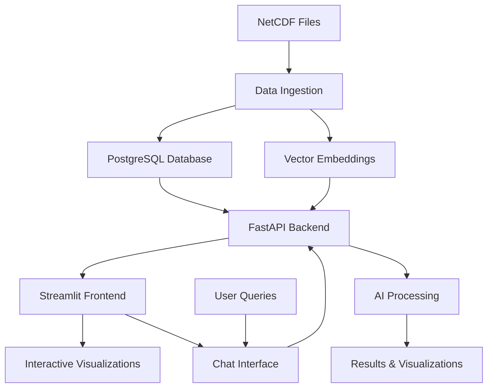

# 🌊 FloatChat - AI-Powered Ocean Data Explorer

<div align="center">


**Where Data Meets the Deep — Time, Depth & Intelligence in One Place**

[](https://python.org)
[](https://streamlit.io)
[](https://fastapi.tiangolo.com)
[](https://postgresql.org)
[](https://huggingface.co/sentence-transformers)
[](LICENSE)

</div>

---

##  What is FloatChat?

FloatChat is an innovative **AI-powered conversational interface** that transforms complex ARGO oceanographic data into intuitive, natural language queries. Built with cutting-edge technologies, it allows researchers, oceanographers, and data enthusiasts to explore ocean data through simple conversations, interactive visualizations, and intelligent insights.

###  Key Highlights

- ** AI-Powered Search**: Uses sentence transformers and semantic embeddings for intelligent data discovery
- ** Geospatial Intelligence**: Automatic geocoding and location-aware filtering
- ** Interactive Visualizations**: Beautiful depth-time plots, 3D maps, and real-time analytics
- ** Natural Language Interface**: Ask questions in plain English about ocean data
- ** Real-time Processing**: Fast query response with intelligent caching and hybrid scoring

###  Key Features

| Feature | Description | Technology |
|---------|-------------|------------|
| **Natural Language Queries** | Ask questions in plain English like "Show salinity near the equator" | Sentence Transformers + Semantic Search |
| **Interactive Visualizations** | Beautiful depth-time plots, 3D maps, and geospatial analysis | Streamlit + Plotly + Lottie Animations |
| **AI-Powered Search** | Semantic search with location-aware filtering and hybrid scoring | PostgreSQL + Vector Embeddings + Cosine Similarity |
| **Geospatial Intelligence** | Location-based queries with automatic geocoding | Geopy + Nominatim + Distance Calculations |
| **Real-time Analytics** | Live data processing and visualization with fallback support | FastAPI + Async Processing + Demo Data |
| **Data Pipeline** | Automated NetCDF ingestion and processing | xarray + pandas + psycopg2 |
| **3D Trajectory Mapping** | Interactive 3D visualization of ARGO float paths | Plotly 3D + Geospatial Coordinates |
| **Smart Dashboards** | Export results in multiple formats with parameter comparisons | CSV, NetCDF, ASCII Export |

---

## Architecture Overview



---

##  Tech Stack

### Backend & API
- **FastAPI** - High-performance async API framework with automatic documentation
- **PostgreSQL** - Relational database for structured oceanographic data
- **Sentence Transformers** - AI embeddings using `all-MiniLM-L6-v2` model (384-dimensional)
- **psycopg2-binary** - PostgreSQL adapter with batch operations
- **Uvicorn** - ASGI server for FastAPI deployment

### Frontend & Visualization
- **Streamlit** - Interactive web application framework with custom CSS styling
- **Plotly** - Advanced 3D and 2D data visualizations with interactive features
- **Lottie Animations** - Beautiful ocean-themed animations for enhanced UX
- **Pandas** - Data manipulation and analysis for real-time processing
- **Geopy + Nominatim** - Geocoding and location services for place name resolution

### Data Processing & ML
- **xarray** - Multi-dimensional NetCDF file processing and analysis
- **NumPy** - Numerical computing for vector operations and similarity calculations
- **Pandas** - Data analysis, manipulation, and time series processing
- **scikit-learn** - Machine learning utilities for similarity calculations
- **SQLAlchemy** - Database ORM for advanced query operations

### Infrastructure & Deployment
- **Docker** - Containerization support (planned)
- **PostgreSQL 13+** - Production-ready database with vector support
- **Python 3.8+** - Modern Python with async/await support

---

##  Project Structure

```
floatchat/
├──  data/                    # Raw NetCDF oceanographic files
│   └── 20250901_prof.nc      # Sample ARGO float data
├── ingestion/               # Data processing pipeline
│   ├── main.py                # NetCDF → PostgreSQL + Vector embeddings
│   ├── requirements.txt       # Ingestion dependencies
│   └── tempCodeRunnerFile.py  # Temporary development files
├──  api/                     # FastAPI backend service
│   ├── app.py                 # Main API application with query processing
│   ├── main.py                # API entry point and server configuration
│   ├── query.py               # Query processing logic
│   ├── fallback_query.py      # Fallback query handling
│   ├── requirements.txt       # Backend dependencies
│   └── dummy.db               # Sample database for testing
├──  frontend/                # Streamlit user interface
│   ├── chatbot_ui.py          # Main chat interface with visualizations
│   ├── landing_page.py        # Beautiful landing page with animations
│   ├── map_page.py            # Geospatial visualizations and 3D maps
│   ├── timedepthplot.py       # Depth-time analysis and heatmaps
│   ├── front.py               # Frontend utilities
│   ├── landingpg.py           # Alternative landing page
│   ├── dummy.py               # Demo data and testing utilities
│   ├── FloatChat.png          # Application logo
│   ├── layered-waves-haikei.svg # Background graphics
│   └── pngwing.com.png        # Additional UI assets
├──  infra/                   # Database setup scripts
│   ├── postgres_init.sql      # PostgreSQL schema and table definitions
│   └── qdrant_setup.py        # Vector database setup (optional)
├──  go-fetcher/              # Optional data fetcher (Go)
│   └── min.go                 # NetCDF file downloader utility
├──  data_processing.py       # Data utilities and processing functions
├──  database.py              # Database connection and SQL utilities
├──  map_viz.py               # Map visualization utilities
├──  map.py                   # Geospatial mapping functions
├──  nearest_float.py         # Nearest neighbor search algorithms
├──  scatter_viz.py           # Scatter plot visualization utilities
├──  demo_argo.db             # Demo SQLite database
├──  dummy.db                 # Sample database for development
├──  requirements.txt         # Main project dependencies
└──  README.md                # This documentation file
```

---

##  Quick Start Guide

### Prerequisites

- **Python 3.8+**
- **PostgreSQL 13+**
- **Git**

### 1️. Clone the Repository

```bash
git clone https://github.com/SyedOwais312/floatchat.git
cd floatchat
```

### 2️. Database Setup

#### PostgreSQL Setup
```bash
# Install PostgreSQL (Ubuntu/Debian)
sudo apt-get install postgresql postgresql-contrib

# Install PostgreSQL (Windows)
# Download from: https://www.postgresql.org/download/windows/

# Install PostgreSQL (macOS)
brew install postgresql

# Create database and user
sudo -u postgres psql
CREATE DATABASE floatchatai;
CREATE USER floatchat_user WITH PASSWORD 'your_secure_password';
GRANT ALL PRIVILEGES ON DATABASE floatchatai TO floatchat_user;
\q

# Initialize schema (if postgres_init.sql exists)
psql -h localhost -U floatchat_user -d floatchatai -f infra/postgres_init.sql
```

#### Database Configuration
Update the database credentials in the following files:
- `api/app.py` - Line 9-14
- `ingestion/main.py` - Line 9-14

```python
DB_CONFIG = {
    "host": "localhost",
    "database": "floatchatai", 
    "user": "floatchat_user",
    "password": "your_secure_password"
}
```

### 3️. Data Ingestion

```bash
# Navigate to ingestion directory
cd ingestion

# Create virtual environment
python -m venv venv

# Activate virtual environment
# Windows:
venv\Scripts\activate
# Linux/Mac:
source venv/bin/activate

# Install dependencies
pip install -r requirements.txt

# Process NetCDF files (ensure data files are in ../data/ directory)
python main.py
```

**Note**: The ingestion process will:
- Process NetCDF files from the `data/` directory
- Extract oceanographic parameters (temperature, salinity, pressure)
- Generate semantic embeddings using Sentence Transformers
- Store data in PostgreSQL with vector embeddings for AI search

### 4️. Backend API

```bash
# Navigate to API directory
cd ../api

# Create virtual environment
python -m venv venv

# Activate virtual environment
# Windows:
venv\Scripts\activate
# Linux/Mac:
source venv/bin/activate

# Install dependencies
pip install -r requirements.txt

# Start the API server
uvicorn app:app --reload --host 0.0.0.0 --port 8000
```

**API Features**:
- Semantic search with sentence transformers
- Geospatial filtering with distance calculations
- Hybrid scoring (70% semantic similarity + 30% geographic proximity)
- Automatic geocoding for place names
- Fallback query handling for offline testing

### 5️. Frontend Application

```bash
# Navigate to frontend directory
cd ../frontend

# Install dependencies
pip install -r requirements.txt

# Start Streamlit application
streamlit run landing_page.py
```

### 6️. Access the Application

- ** Frontend**: http://localhost:8501 - Interactive ocean data explorer
- ** API Documentation**: http://localhost:8000/docs - Interactive API documentation
- ** API Health Check**: http://localhost:8000/health - Service status endpoint
- ** Map Visualization**: http://localhost:8501/map_page - 3D geospatial analysis
- ** Time-Depth Analysis**: http://localhost:8501/timedepthplot - Ocean parameter heatmaps

---

## Usage Examples

### Natural Language Queries

FloatChat understands natural language queries about ocean data:

```python
# Example queries you can ask:
"Show salinity profiles near the equator in March 2023"
"Compare temperature in Arabian Sea last 6 months"
"Find temperature data at lat=-43.037, long=130"
"Show me ocean data near Mumbai"
"What's the salinity trend in the Pacific Ocean?"
```

### API Usage

```python
import requests
import json

# Query the API
response = requests.post("http://localhost:8000/query", 
                        json={"query": "Show salinity near the equator"})
data = response.json()

# Access results
for profile in data:
    print(f"Profile ID: {profile['profile_id']}")
    print(f"Location: {profile['lat']}, {profile['lon']}")
    print(f"Time: {profile['time']}")
    print(f"Depth levels: {len(profile['depth_levels'])}")
    print(f"Query explanation: {profile['query_explain']}")
    
    # Access depth-level data
    for level in profile['depth_levels']:
        print(f"  Pressure: {level['pres']} dbar, "
              f"Temperature: {level['temp']}°C, "
              f"Salinity: {level['salinity']} PSU")
```

### Advanced Query Examples

```python
# Geospatial queries
queries = [
    "Show temperature data at lat=-43.037, long=130",
    "Find salinity profiles near Mumbai",
    "Compare temperature in Arabian Sea last 6 months",
    "Show me ocean data near the equator",
    "What's the salinity trend in the Pacific Ocean?"
]

for query in queries:
    response = requests.post("http://localhost:8000/query", 
                            json={"query": query})
    results = response.json()
    print(f"Query: {query}")
    print(f"Found {len(results)} matching profiles")
```

---

## Key Features in Detail

###  Conversational AI Interface

- **Natural Language Processing**: Ask questions in plain English
- **Context Awareness**: Understands oceanographic terminology
- **Location Intelligence**: Automatic geocoding of place names
- **Smart Filtering**: Combines semantic search with geographic proximity

###  Advanced Visualizations

- **Depth-Time Heatmaps**: Visualize ocean parameters across time and depth
- **3D Trajectory Maps**: Interactive 3D visualization of ARGO float paths
- **Geospatial Analysis**: Map-based exploration of ocean data
- **Parameter Comparisons**: Side-by-side analysis of different ocean variables

### AI-Powered Search

- **Semantic Search**: Find relevant data using meaning, not just keywords
- **Vector Embeddings**: 384-dimensional embeddings for precise matching
- **Hybrid Scoring**: Combines semantic similarity with geographic proximity
- **Real-time Processing**: Fast query response with intelligent caching

---

## Configuration

### Database Configuration

Update database credentials in the respective files:

```python
# api/app.py, ingestion/main.py
DB_CONFIG = {
    "host": "localhost",
    "database": "floatchatai",
    "user": "your_username",
    "password": "your_password"
}
```

### API Configuration

```python
# api/app.py
TOP_K = 3                    # Number of top results to return
RADIUS_METERS = 50_000       # Search radius in meters
MODEL_NAME = 'all-MiniLM-L6-v2'  # Sentence transformer model
```

---

## Data Format

### Input Data
- **NetCDF Files**: ARGO float data in standard NetCDF format
- **Variables**: Temperature (TEMP), Salinity (PSAL), Pressure (PRES)
- **Metadata**: Latitude, Longitude, Time (JULD), Platform Number

### Output Data
```json
{
  "profile_id": 123,
  "lat": -43.037,
  "lon": 130.0,
  "time": "2023-03-15 12:00:00",
  "depth_levels": [
    {"pres": 5.0, "temp": 18.5, "salinity": 35.2},
    {"pres": 10.0, "temp": 18.3, "salinity": 35.1}
  ],
  "query_explain": "Matched using weighted embedding similarity..."
}
```

## Configuration

### Database Configuration

Update database credentials in the respective files:

```python
# api/app.py, ingestion/main.py
DB_CONFIG = {
    "host": "localhost",
    "database": "floatchatai",
    "user": "your_username",
    "password": "your_password"
}
```

### API Configuration

```python
# api/app.py
TOP_K = 3                    # Number of top results to return
RADIUS_METERS = 50_000       # Search radius in meters
MODEL_NAME = 'all-MiniLM-L6-v2'  # Sentence transformer model
```

### Frontend Configuration

```python
# frontend/chatbot_ui.py
API_BASE_URL = "http://127.0.0.1:5000"  # Backend API URL
TIMEOUT_SECONDS = 30                     # Request timeout
```

---

## Data Format

### Input Data
- **NetCDF Files**: ARGO float data in standard NetCDF format
- **Variables**: Temperature (TEMP), Salinity (PSAL), Pressure (PRES)
- **Metadata**: Latitude, Longitude, Time (JULD), Platform Number

### Output Data
```json
{
  "profile_id": 123,
  "lat": -43.037,
  "lon": 130.0,
  "time": "2023-03-15 12:00:00",
  "depth_levels": [
    {"pres": 5.0, "temp": 18.5, "salinity": 35.2},
    {"pres": 10.0, "temp": 18.3, "salinity": 35.1}
  ],
  "query_explain": "Matched using weighted embedding similarity..."
}
```

---

## Deployment

### Production Deployment

1. **Environment Variables**
```bash
export DB_HOST=your_production_host
export DB_NAME=floatchatai_prod
export DB_USER=your_prod_user
export DB_PASSWORD=your_secure_password
```

2. **Docker Deployment** (Coming Soon)
```bash
docker-compose up -d
```

3. **Cloud Deployment**
- AWS: Use RDS for PostgreSQL, EC2 for application servers
- Google Cloud: Cloud SQL + Compute Engine
- Azure: Azure Database for PostgreSQL + App Service

---

## Contributing

We welcome contributions! Please follow these steps:

1. **Fork the repository**
2. **Create a feature branch**: `git checkout -b feature/amazing-feature`
3. **Commit your changes**: `git commit -m 'Add amazing feature'`
4. **Push to the branch**: `git push origin feature/amazing-feature`
5. **Open a Pull Request**

### Development Setup

```bash
# Install development dependencies
pip install -r requirements-dev.txt

# Run tests
pytest tests/

# Format code
black .
flake8 .
```

---
## Acknowledgments

- **ARGO Program** - For providing the oceanographic data
- **Streamlit** - For the amazing web framework
- **FastAPI** - For the high-performance API framework
- **PostgreSQL** - For the robust database system
- **Sentence Transformers** - For the semantic search capabilities
- **Hugging Face** - For the pre-trained models
- **Plotly** - For the interactive visualizations
- **Geopy** - For geocoding services

---

## Support

- **Issues**: [GitHub Issues](https://github.com/SyedOwais312/floatchat/issues)
- **Discussions**: [GitHub Discussions](https://github.com/SyedOwais312/floatchat/discussions)
---

## Roadmap

- [ ] **Docker Support** - Containerized deployment
- [ ] **Real-time Data Streaming** - Live ARGO data integration
- [ ] **Machine Learning Models** - Predictive ocean analytics
- [ ] **Multi-language Support** - Internationalization
- [ ] **Mobile App** - iOS and Android applications
- [ ] **Advanced Visualizations** - VR/AR ocean exploration
- [ ] **Data Export** - Multiple format support (HDF5, Zarr)
- [ ] **API Rate Limiting** - Production-ready API management

---

<div align="center">

[](https://github.com/SyedOwais312/floatchat)
[](https://github.com/SyedOwais312/floatchat)

</div>

