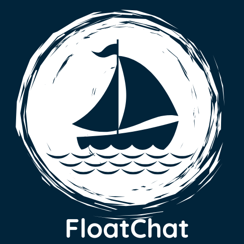
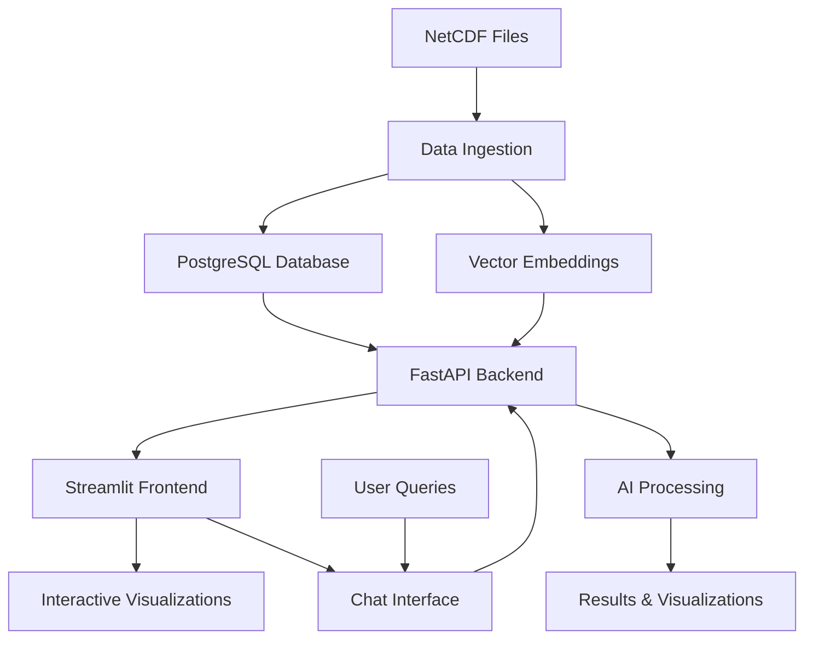

# 🌊 FloatChat - AI-Powered Ocean Data Explorer

<div align="center">



**Where Data Meets the Deep — Time, Depth & Intelligence in One Place**

[](https://python.org)
[](https://streamlit.io)
[](https://fastapi.tiangolo.com)
[](https://postgresql.org)
[](LICENSE)

</div>

---

##  What is FloatChat?

FloatChat is an innovative **AI-powered conversational interface** that transforms complex ARGO oceanographic data into intuitive, natural language queries. Built with cutting-edge technologies, it allows researchers, oceanographers, and data enthusiasts to explore ocean data through simple conversations, interactive visualizations, and intelligent insights.

### ✨ Key Features

| Feature | Description | Technology |
|---------|-------------|------------|
| **Natural Language Queries** | Ask questions in plain English like "Show salinity near the equator" | RAG + Sentence Transformers |
|  **Interactive Visualizations** | Beautiful depth-time plots, 3D maps, and geospatial analysis | Streamlit + Plotly |
| **AI-Powered Search** | Semantic search with location-aware filtering | PostgreSQL + Vector Embeddings |
| **Geospatial Intelligence** | Location-based queries with automatic geocoding | Geopy + Nominatim |
| **Real-time Analytics** | Live data processing and visualization | FastAPI + Async Processing |
| **Data Pipeline** | Automated NetCDF ingestion and processing | xarray + pandas |

---

## Architecture Overview



---

## 🛠️ Tech Stack

### Backend
- **FastAPI** - High-performance API framework
- **PostgreSQL** - Relational database for structured data
- **Sentence Transformers** - AI embeddings for semantic search
- **xarray** - NetCDF file processing
- **psycopg2** - PostgreSQL adapter

### Frontend
- **Streamlit** - Interactive web application framework
- **Plotly** - Advanced data visualizations
- **Pandas** - Data manipulation and analysis
- **Geopy** - Geocoding and location services

### Data Processing
- **xarray** - Multi-dimensional array processing
- **NumPy** - Numerical computing
- **Pandas** - Data analysis and manipulation

---

## 📁 Project Structure

```
floatchat/
├──  data/                    # Raw NetCDF oceanographic files
├── ingestion/               # Data processing pipeline
│   ├── main.py                # NetCDF → PostgreSQL + Vector DB
│   ├── requirements.txt       # Python dependencies
│   └── venv/                  # Virtual environment
├──  api/                     # FastAPI backend service
│   ├── app.py                 # Main API application
│   ├── main.py                # API entry point
│   ├── requirements.txt       # Backend dependencies
│   └── venv/                  # Virtual environment
├──  frontend/                # Streamlit user interface
│   ├── chatbot_ui.py          # Chat interface
│   ├── landing_page.py        # Beautiful landing page
│   ├── map_page.py            # Geospatial visualizations
│   ├── timedepthplot.py       # Depth-time analysis
│   └── *.png                  # UI assets and logos
├──  infra/                   # Database setup scripts
│   ├── postgres_init.sql      # PostgreSQL schema
│   └── qdrant_setup.py        # Vector database setup
├──  go-fetcher/              # Optional data fetcher (Go)
│   └── min.go                 # NetCDF file downloader
├──  data_processing.py       # Data utilities
├──  database.py              # Database connection utilities
└──  requirements.txt         # Main project dependencies
```

---

## 🚀 Quick Start Guide

### Prerequisites

- **Python 3.8+**
- **PostgreSQL 13+**
- **Git**

### 1️. Clone the Repository

```bash
git clone https://github.com/SyedOwais312/floatchat.git
cd floatchat
```

### 2️. Database Setup

#### PostgreSQL Setup
```bash
# Install PostgreSQL (Ubuntu/Debian)
sudo apt-get install postgresql postgresql-contrib

# Create database and user
sudo -u postgres psql
CREATE DATABASE floatchatai;
CREATE USER floatchat_user WITH PASSWORD 'your_password';
GRANT ALL PRIVILEGES ON DATABASE floatchatai TO floatchat_user;
\q

# Initialize schema
psql -h localhost -U floatchat_user -d floatchatai -f infra/postgres_init.sql
```

### 3️. Data Ingestion

```bash
# Navigate to ingestion directory
cd ingestion

# Create virtual environment
python -m venv venv

# Activate virtual environment
# Windows:
venv\Scripts\activate
# Linux/Mac:
source venv/bin/activate

# Install dependencies
pip install -r requirements.txt

# Process NetCDF files
python main.py
```

### 4️. Backend API

```bash
# Navigate to API directory
cd ../api

# Create virtual environment
python -m venv venv

# Activate virtual environment
# Windows:
venv\Scripts\activate
# Linux/Mac:
source venv/bin/activate

# Install dependencies
pip install -r requirements.txt

# Start the API server
uvicorn app:app --reload --host 0.0.0.0 --port 8000
```

### 5️. Frontend Application

```bash
# Navigate to frontend directory
cd ../frontend

# Install dependencies
pip install -r requirements.txt

# Start Streamlit application
streamlit run landing_page.py
```

### 6️. Access the Application

- **Frontend**: http://localhost:8501
- **API Documentation**: http://localhost:8000/docs
- **API Health Check**: http://localhost:8000/health

---

## Usage Examples

### Natural Language Queries

FloatChat understands natural language queries about ocean data:

```python
# Example queries you can ask:
"Show salinity profiles near the equator in March 2023"
"Compare temperature in Arabian Sea last 6 months"
"Find temperature data at lat=-43.037, long=130"
"Show me ocean data near Mumbai"
"What's the salinity trend in the Pacific Ocean?"
```

### API Usage

```python
import requests

# Query the API
response = requests.post("http://localhost:8000/query", 
                        json={"query": "Show salinity near the equator"})
data = response.json()

# Access results
for profile in data:
    print(f"Location: {profile['lat']}, {profile['lon']}")
    print(f"Time: {profile['time']}")
    print(f"Depth levels: {len(profile['depth_levels'])}")
```

---

## 🎯 Key Features in Detail

###  Conversational AI Interface

- **Natural Language Processing**: Ask questions in plain English
- **Context Awareness**: Understands oceanographic terminology
- **Location Intelligence**: Automatic geocoding of place names
- **Smart Filtering**: Combines semantic search with geographic proximity

###  Advanced Visualizations

- **Depth-Time Heatmaps**: Visualize ocean parameters across time and depth
- **3D Trajectory Maps**: Interactive 3D visualization of ARGO float paths
- **Geospatial Analysis**: Map-based exploration of ocean data
- **Parameter Comparisons**: Side-by-side analysis of different ocean variables

### AI-Powered Search

- **Semantic Search**: Find relevant data using meaning, not just keywords
- **Vector Embeddings**: 384-dimensional embeddings for precise matching
- **Hybrid Scoring**: Combines semantic similarity with geographic proximity
- **Real-time Processing**: Fast query response with intelligent caching

---

## Configuration

### Database Configuration

Update database credentials in the respective files:

```python
# api/app.py, ingestion/main.py
DB_CONFIG = {
    "host": "localhost",
    "database": "floatchatai",
    "user": "your_username",
    "password": "your_password"
}
```

### API Configuration

```python
# api/app.py
TOP_K = 3                    # Number of top results to return
RADIUS_METERS = 50_000       # Search radius in meters
MODEL_NAME = 'all-MiniLM-L6-v2'  # Sentence transformer model
```

---

## Data Format

### Input Data
- **NetCDF Files**: ARGO float data in standard NetCDF format
- **Variables**: Temperature (TEMP), Salinity (PSAL), Pressure (PRES)
- **Metadata**: Latitude, Longitude, Time (JULD), Platform Number

### Output Data
```json
{
  "profile_id": 123,
  "lat": -43.037,
  "lon": 130.0,
  "time": "2023-03-15 12:00:00",
  "depth_levels": [
    {"pres": 5.0, "temp": 18.5, "salinity": 35.2},
    {"pres": 10.0, "temp": 18.3, "salinity": 35.1}
  ],
  "query_explain": "Matched using weighted embedding similarity..."
}
```

##  Acknowledgments

- **ARGO Program**
- **Streamlit** 
- **FastAPI** 
- **PostgreSQL** 
- **Sentence Transformers** 

---

##  Support

- **Documentation**: [Wiki](https://github.com/SyedOwais312/floatchat/wiki)

---

<div align="center">

[Explore the Depths](http://localhost:8501) • [ Documentation](https://github.com/SyedOwais312/floatchat/wiki) • [Report Bug](https://github.com/SyedOwais312/floatchat/issues)

</div>
